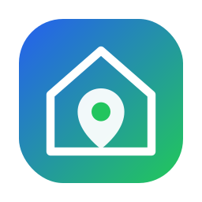

<p align="center">
  
</p>

<h2 align="center">EstateHub</h2>

<p align="center">
  Student full-stack project: a microservice-based real estate listings platform.
</p>

---

## Overview

**EstateHub** is a web application for publishing and browsing real-estate listings. The repository contains:

- **`EstateHub.BackEnd/`**: ASP.NET Core 8 microservices (Auth + Listings)
- **`EstateHub.Frontend/`**: React + TypeScript application (Vite for dev, Nginx in Docker)
- **`docker-compose.yml`**: local stack (services + databases + MailHog)
- **`docs/`**: design document and diagrams

## Key features (implemented / in-progress)

- **Authentication & accounts**: registration/login, JWT, roles, email flows (SMTP)
- **Listings**: create/browse/search listings
- **GraphQL API**: ListingService exposes GraphQL at `/graphql`
- **Photos**: photo API under `/api/photo/*` (backed by MongoDB GridFS in Docker setup)
- **Health checks**: `/health`, `/health/ready`, `/health/live`
- **Dev mail inbox**: MailHog UI for local SMTP testing

Planned items are described in `docs/HighLevelDesign.md`.

## Tech stack

- **Frontend**: React, TypeScript, Vite, React Router, Apollo Client, Leaflet
- **Backend**: .NET 8 (ASP.NET Core), Serilog, HotChocolate (GraphQL), gRPC (service-to-service)
- **Databases**: MS SQL Server (service data), MongoDB (files/photos)
- **Infra (local)**: Docker Compose, Nginx (serves UI + reverse proxy), MailHog

## Quick start (Docker)

### Prerequisites

- **Docker Desktop**
- (Optional) **Node.js 18+** and **.NET 8 SDK** for running without containers

### Run the whole stack

1) Create local env file:

```bash
cp .env.example .env
```

2) Start the stack:

```bash
docker compose up --build
```

### Local URLs

- **Frontend (Nginx)**: `http://localhost:3001`
- **ListingService GraphQL (via frontend proxy)**: `http://localhost:3001/graphql`
- **AuthService API (via frontend proxy)**: `http://localhost:3001/auth/`
- **MailHog UI**: `http://localhost:8025`
- **SQL Server**: `localhost:1433`
- **MongoDB**: `localhost:27017`

> Note: inside Docker the frontend proxies requests to internal service names (`auth-service`, `listing-service`). That’s why the `.env.example` uses relative URLs like `/graphql` and `/auth`.

### Stop / reset

```bash
docker compose down
```

To remove persisted databases too:

```bash
docker compose down -v
```

## Run in development (without Docker)

### Frontend

```bash
cd EstateHub.Frontend
npm install
npm run dev
```

By default Vite serves at `http://localhost:5173`.

### Backend

You can run services from the solution:

```bash
cd EstateHub.BackEnd
dotnet restore
dotnet run --project EstateHub.Authorization.API
dotnet run --project EstateHub.ListingService.API
```

You’ll also need local databases (SQL Server + MongoDB) and appropriate connection strings. For Docker-based development, prefer the Docker workflow above.

## Configuration

All Docker configuration is driven by environment variables from `.env` (see `.env.example`).

### Most important variables

- **Database**: `DB_USER`, `DB_PASSWORD`, `DB_PORT`, `MSSQL_PID`
- **Service ports**: `AUTH_HTTP_PORT`, `AUTH_GRPC_PORT`, `LISTING_HTTP_PORT`, `FRONTEND_PORT`
- **JWT**: `JWT_SECRET`, `JWT_ISSUER`, `JWT_AUDIENCE`
- **MongoDB**: `MONGO_USERNAME`, `MONGO_PASSWORD`, `MONGO_DATABASE`, `MONGO_GRIDFS_BUCKET`
- **SMTP / MailHog**: `SMTP_HOST`, `SMTP_PORT`, `MAILHOG_UI_PORT`
- **Frontend (Docker build args)**:
  - `VITE_LISTING_SERVICE_GRAPHQL_URL` (default: `/graphql`)
  - `VITE_LISTING_SERVICE_ASSETS_URL` (default: `/api/photo`)
  - `VITE_AUTHORIZATION_SERVICE_URL` (default: `/auth`)

### Security note

- **Do not commit real secrets**. Keep `.env` local; use `.env.example` for defaults/templates.

## Services

### AuthService (`EstateHub.Authorization.API`)

- **Purpose**: users, sessions, JWT, roles, email flows
- **Ports (Docker)**:
  - HTTP: `${AUTH_HTTP_PORT}` → container `8080`
  - gRPC: `${AUTH_GRPC_PORT}` → container `8082`
- **Health**: `/health`, `/health/ready`, `/health/live`
- **Swagger**: enabled in Development environment

### ListingService (`EstateHub.ListingService.API`)

- **Purpose**: listings domain + photos + moderation/AI hooks (some features may be experimental)
- **Port (Docker)**: `${LISTING_HTTP_PORT}` → container `8080`
- **GraphQL**: `/graphql`
- **Health**: `/health`, `/health/ready`, `/health/live`

## Testing

Backend has unit test projects in:

- `EstateHub.BackEnd/EstateHub.Authorization.Core.Tests`
- `EstateHub.BackEnd/EstateHub.ListingService.Core.Tests`

Run:

```bash
cd EstateHub.BackEnd
dotnet test
```

## Project structure (high level)

```text
.
├── EstateHub.BackEnd/              # .NET solution with microservices
├── EstateHub.Frontend/             # React + TypeScript UI
├── docker-compose.yml              # Local stack (services + db + mail)
└── docs/                           # High-level design + diagrams
```

## Documentation

- **High-level design**: `docs/HighLevelDesign.md`
- **Data flow diagram**: `docs/assets/Data_flow_diagram.png`

## Author

This repository is maintained as a **student diploma project**.

