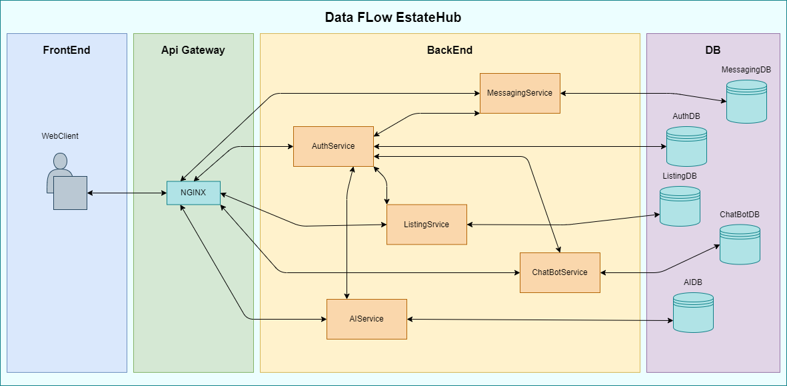

  

<h1 align="center">High-Level Design Document</h1>

## 1. Zakres projektu i cele

### 1.1 Opis projektu

**EstateHub** to platforma ogłoszeń nieruchomości działająca w architekturze mikroserwisowej, umożliwiająca użytkownikom publikowanie, przeglądanie oraz zarządzanie ofertami sprzedaży i wynajmu nieruchomości. System wspiera bezpieczną komunikację, zarządzanie kontami użytkowników, a także zaawansowane funkcje oparte na AI.

### 1.2 Cele projektu

- Zapewnienie pełnej funkcjonalności platformy ogłoszeń z obsługą kont użytkowników.
- Wdrożenie modularnych mikroserwisów odpowiadających za różne aspekty systemu.
- Wsparcie AI dla rekomendacji i analizy cen.
- Intuicyjny interfejs użytkownika i skalowalna architektura backendu.

#### Stos technologiczny

| Warstwa                 | Technologie                                        |
|------------------------|----------------------------------------------------|
| **Frontend**           | React + TypeScript                                 |
| **Backend**            | ASP.NET Core                                       |
| **Bazy danych**        | MS SQL Server (osobne bazy dla każdego mikroserwisu) |
| **Komunikacja realtime** | SignalR                            |
| **AI/ML**              | ML.NET, ONNX, Azure Cognitive Services             |
| **Konteneryzacja**     | Docker + Docker Compose                            |
| **CI/CD**              | GitHub Actions                          |
| **Gateway**            | NGINX                   |

---

## 2. Moduły systemu i odpowiedzialności

### 2.1 Przegląd systemu

System składa się z następujących komponentów:

- **Frontend** – aplikacja webowa React
- **API Gateway**  – proxy do trasowania ruchu
- **AuthService** – logowanie, rejestracja, sesje, role
- **ListingService** – zarządzanie ogłoszeniami nieruchomości
- **MessagingService** – wiadomości użytkownik↔użytkownik
- **ChatbotService** – chatbot wspierany przez AI
- **AI Microservices** – silnik rekomendacji, predykcja cen
- **SharedKernel** – wspólne DTO, klienty, ResultExecutor
- **Bazy danych** – osobna baza dla każdego mikroserwisu

---

### 2.2 Odpowiedzialności modułów

#### Frontend

- UI do przeglądania i tworzenia ogłoszeń.
- Panel użytkownika, rejestracja/logowanie.
- Obsługa wiadomości i integracja z chatbotem.
- Komunikacja z API i WebSocket (SignalR – planowany).

#### API Gateway 

- Trasowanie żądań do odpowiednich mikroserwisów.
- Ochrona dostępu, SSL termination, logowanie.
- (Opcjonalnie) throttling i cache.

#### AuthService 

- Rejestracja, logowanie, zarządzanie sesjami JWT.
- Przypisanie ról (Buyer, Seller, Admin).
- Resetowanie haseł, potwierdzenie e-mail.
- Endpointy dla innych mikroserwisów do weryfikacji tokenów i pobierania danych użytkownika.

#### ListingService

- Tworzenie, edycja i usuwanie ogłoszeń.
- Wyszukiwanie według lokalizacji, ceny, metrażu, typu.
- Obsługa zdjęć i danych geolokalizacyjnych.

#### MessagingService

- Wiadomości prywatne między użytkownikami (Kupujący ↔ Sprzedawca).
- Historia czatu, powiadomienia.
- Integracja z SignalR.

#### ChatbotService

- Asystent AI odpowiadający na pytania użytkowników.
- Informacje o rynku, lokalizacjach, dojazdach, szkołach.
- API wspierane przez model językowy / baza wiedzy.

#### AI Microservices

- **Recommendation Engine**: Analiza aktywności użytkownika (ulubione, wyszukiwania) → rekomendacje ofert.
- **Price Prediction**: Predykcja ceny na podstawie lokalizacji, powierzchni, typu, trendów rynkowych.

#### SharedKernel 

- Interfejsy (`IUserServiceClient`, `IUnitOfWork`).
- ResultExecutor, struktury błędów, DTO, obsługa wyjątków.
- Atrybuty, middleware, mikroserwisowe kontrakty.

---

### 2.3 Przepływ danych i komunikacja

#### Główne przepływy komunikacji

1. **Frontend ⇄ API Gateway**

   * Trasowanie żądań do odpowiednich usług backendowych.
   * Obsługa uwierzytelniania i autoryzacji (przekazywanie nagłówków JWT).
   * Ochrona dostępu do wewnętrznych mikroserwisów.

2. **API Gateway ⇄ AuthService**

   * Logowanie, rejestracja, aktualizacja konta, tokeny.
   * Resetowanie hasła, potwierdzenie e-mail.

3. **API Gateway ⇄ ListingService**

   * Operacje CRUD na ogłoszeniach.
   * Wyszukiwanie, filtrowanie, sortowanie ofert.

4. **API Gateway ⇄ MessagingService**

   * WebSocket/REST – wysyłanie/odbieranie wiadomości.
   * Lista konwersacji, powiadomienia.

5. **API Gateway ⇄ ChatbotService**

   * Pytania i odpowiedzi użytkownika.
   * Wsparcie dla wyszukiwania lokalizacji, rynku, szkół, transportu.

6. **API Gateway ⇄ AI Microservices**

   * Przekazywanie żądań rekomendacji ofert i predykcji cenowych.
   * Wysyłka danych wejściowych (lokalizacja, metraż, preferencje).

7. **AuthService ⇄ ListingService/MessagingService/ChatbotService/AI Microservices**

   * Weryfikacja tokenów JWT (np. `UserId`, `Roles`).
   * Pobieranie danych użytkownika na potrzeby autoryzacji działań (np. czy użytkownik ma dostęp do zasobu).

8. **AuthService ⇄ AuthDB**

   * Odczyt i zapis danych użytkowników, sesji, ról, tokenów.
   * Operacje związane z rejestracją, logowaniem, aktualizacją konta.

9. **ListingService ⇄ ListingDB**

   * Zapis i odczyt danych ogłoszeń, zdjęć, lokalizacji.
   * Operacje filtrowania i indeksowania ofert.

10. **MessagingService ⇄ MessagingDB**

   * Przechowywanie konwersacji i wiadomości.
   * Oznaczenia przeczytania, statusy wiadomości, historia.

11. **ChatbotService ⇄ ChatbotDB**

   * Pamięć konwersacyjna, zapisywanie pytań i odpowiedzi.
   * Baza wiedzy lokalna lub cache wyników zewnętrznych źródeł.

12. **AI Microservices ⇄ AIDB**

   * Przechowywanie danych treningowych, modeli ML, logów predykcji.
   * Uczenie modeli i analiza aktywności użytkowników.

---

### Diagram przepływu danych

  

---

## Historia wersji dokumentu

| Wersja | Data       | Autor             | Zmiany                                           |
|--------|------------|------------------|--------------------------------------------------|
| A1     | 2025-06-08 | Artem Omelchenko  | Pierwsza wersja dokumentu dla AuthService       |

